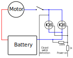

Simplified shematics and description
====================================

This simplified schematics applies to the Circular Saw and likely for other tools
that do no regulate the speed of the motor. Drills that utilize
[PWM](https://en.wikipedia.org/wiki/Pulse-width_modulation) to change the motor
speed may have a different electronics.

The N-Fet transistors are used solely for battery undervoltage protection and
possibly for other error states, that means that there are no switching losses
and that the gate resistor can be rather large. This also means it's unlikely
that it will be damaged when the transistors burn. However it's good to check
if the gate resistor is good before attempting to fix the tool. There are
usually two resistors connected right to the gate of the transistor. One in the
orders of 100k which is a pull-down connected to the ground, this one is nearly
impossible to be damaged. And second smaller that goes to the
[MCU](https://en.wikipedia.org/wiki/Microcontroller), if it's around 1k, it's
also very unlikely to burn. If it's significantly smaller (two orders of
magnitude) it may be damaged, or possibly the driver IC (MCU) may be damaged too.

The [MCU](https://en.wikipedia.org/wiki/Microcontroller), when the switch is
pressed, turns on the transistors and they remain turned on for about 30
seconds after the switch has been turned off. The same applies for the laser
guide, when turned on it turns the power for the motor as well.

Zjednodusene schema a popis
===========================

Zjednodusene schema je aplikovatelne na okruzni pilu a pravdepodobne jine naradi,
ktere neregule rychlost motoru. Vrtacky, ktere pouzivaji
[PWM](https://cs.wikipedia.org/wiki/Pulzn%C4%9B_%C5%A1%C3%AD%C5%99kov%C3%A1_modulace)
k regulaci rychlosti motoru muzou mit jinou elektroniku.

N-Fet tranzistory jsou pouzity pouze pro podpetovou ochranu baterie a pripadne
jine druhy poruchovych stavu, to znamena ze tranzistory nemaji spinaci ztraty a
budici odpor do Gate tranzistoru muze byt relativne veliky. To take znamena, ze
je nepravdepodobne jeho poskozeni, kdyz shori spinaci tranzistory. V kazdem
pripade je rouzmne zkontrolovat budici rezistor pred samotnou opravou. V
zapojeni jsou typicky dva rezistory, jeden radove 100k pull-down zapojeny z
Gate na zem, ktery je temer nemozne poskodit. Druhy mensi resistor je zapojeny do
[MCU](https://cs.wikipedia.org/wiki/Jedno%C4%8Dipov%C3%BD_po%C4%8D%C3%ADta%C4%8D)
a pokud ma radove 1k, je velmi nepravdepodobne, ze by shorel. Pokud je vyrazne
mensi (cca dva o rady) muze byt poskozeny, pripadne i s driver chipem (MCU).

[MCU](https://cs.wikipedia.org/wiki/Jedno%C4%8Dipov%C3%BD_po%C4%8D%C3%ADta%C4%8D),
pri sepnuti vypinace, sepne tranzistory, ktere zustanou zapnute jeste cca 30
sekud po odpojeni vypinace. A stejne tak pri zapnuti laseroveho voditka je
sepnuto napajeni motoru.

