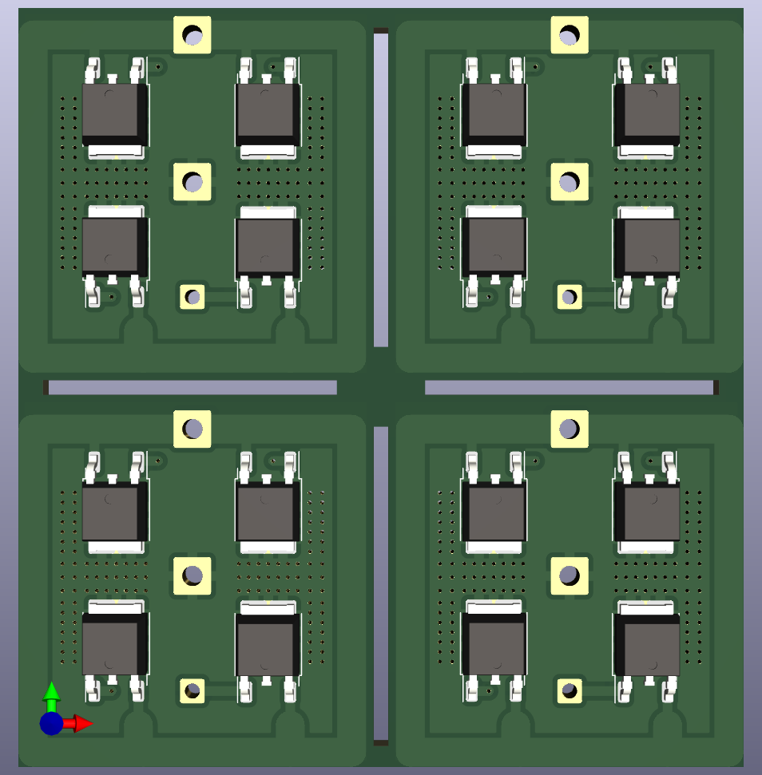
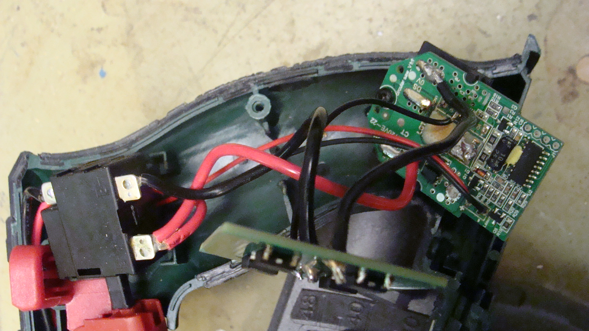
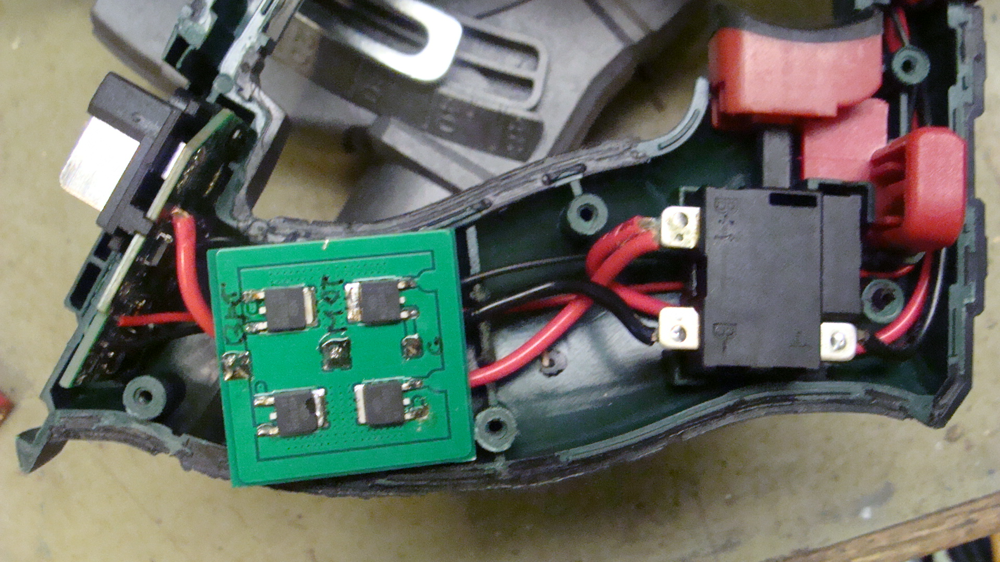

Parkside FET transistor repair
==============================

The cheaper green line of Parkside 'X 20 V Team' tools has a problem with FET
transistor not being able to handle the current when the motor gets under a
load. In that case the transistors burn and partially damage the PCB with the
controller. This repository contains a PCB for four FET transistors, originally
there are two inside, that can be used to repair tools with partially damaged
PCB by soldering the PCB with transistors using two additional wires. The PCB
has four transistors instead of two in order to better distribute the load and
improve heat dissipation. This all works well the only problem is the limited
space in certain models, in which case it's possible to cut the PCB into two
pieces by cutting it vertically and soldering them together under a suitable
angle.

> [!WARNING]
> Unprofessional modification of electric tools can cause an injury and fire. Any
> modification are done at your own risk.

Instructions
------------

* The kicad/trans-gerb.zip file si ready to be send to PCB manufacturers
* Suitable transistors are 30V N-channel FET in TO-252 such as NCE3080 or NCE3090
* Remove burned transistors from the original board
* Solder the transistors to the new PCB, may require pre-heating and solder paste
* Solder the black (negative) wire from the motor to the middle contact of the new PCB
* Use thick wire to connect negative battery contact to the outher bigger contact
* Use thin wire to connect the gate signal from the original board to the
  outher smalle contact of the new PCB
* Use thin wire to connect the motor negative, the middle contact in the new
  PCB, back to the original board where the motor negative was connected.
  There is a circuit that is connected in parallel to the transistors that
  allows detection of the closed cicuit via motor and switch. Beware that this
  wire is not on the photos!

Parkside oprava FET transistoru
===============================

Levnejsi zelena rada naradi Parkside 'X 20 V Team' ma problemy s FET
tranzistory, ktere nezvladaji proud motorem pod zatezi a shori pricemz castecne
poskodi plosny spoj s ridicim obvodem. V tomto repozitari najdete plosny spoj
pro ctyri FET tranzistory, originalne jsou uvnitr dva, kterym muzete nahradit
puvodni tranzistory pripajenim tohoto plosneho spoje pomoci dvou dratu. Nahrada
ma ctyri transistory namisto dvou, aby se lepe rozlozil proud a zlepsilo
chlazeni. Jediny problem s opravou muze byt nedostatek mista v nekterych
modelech naradi, pricemz jedna z moznosti jak to napravit je rozriznout plosny
spoj vertikalne a sletovat dohromady pod vhodnym uhlem.

> [!WARNING]
> Neodbornych zasahem do elektrickeho zarizeni muzete zpusobit uraz ci pozar.
> Veskere upravy naradi delate na svou zodpovednost.

Instrukce
---------

* Soubor kicad/trans-gerb.zip je nachystany pro firmy ktere se zabyvaji vyrobou plosnych spoju
* Vhodne tranzistory jsou 30V N-channel FETy v TO-252 napriklad NCE3080 nebo NCE3090
* Odstrante shorele tranzistory z puvodniho plosneho spoje
* Priletujte tranzistory na novy plosny spoj, idealne s pouzitim predehrevu a pajeci pasty
* Priletujte cerny (negativni) drat od motoru do prostredniho kontaku noveho plosneho spoje
* Pouzijte tlusty drat pro pripojeni zaporneho kontaktu baterie k vnejsimu vetsimu kontaktu
* Pouzijte tenky drat pro pripojeni ridiciho signalu gate z originalni desky na
  vnejsi mensi kontakt noveho plosneho spoje
* Pouzijte tenky drat pro pripojeni zaporneho kontaktu motoru ze stredu noveho
  plosneho spoje, zpatky na originalni plosny spoj, kde byl pred tim pripojen
  zaporny kontakt motoru. Na desce je obvod pripojeny paraelne k tranzistorum,
  ktery umoznuje detekci uzavreneho obvodu pres motor a vypinac. Pozor na fotce
  tento drat chybi!

